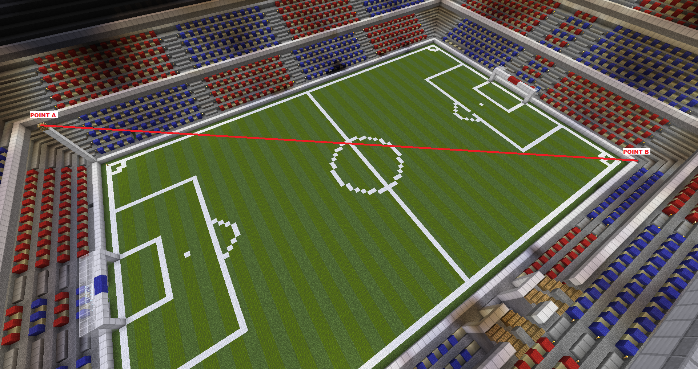

# Creating a new game

This page explains step by step to setup a new game.

## Minimum required setup

### Create a new game

Execute the following command to create a new arena file.

```
/blockball create game1 My first game
```

### Confirm that the arena has been created

Execute the following command to list all games:

```
/blockball list
```

Output:

```
game1 [My first game] [disabled]
```

You can see that the arena is still disabled and cannot be joined yet.

### Get the selection axe

Get the blockball selection axe for selecting the spawnspoints and other areas.

```
/blockball axe
```

### Enable highlighting

You can toggle highlighting important areas when editing your game. This makes it easier to edit them.

```
/blockball highlight game1
```

### Setting the playing field

Select ``Point A`` with left-clicking using the BlockBall axe and ``Point B`` with right-clicking using the BlockBall axe.
Then execute the command below.




```
/blockball select game1 field
```

### Setting the goal of team red

Select ``Point A`` with left-clicking using the BlockBall axe and ``Point B`` with right-clicking using the BlockBall axe.
Then execute the command below.


```
/blockball select game1 red_goal
```

### Setting the goal of team blue

Select ``Point A`` with left-clicking using the BlockBall axe and ``Point B`` with right-clicking using the BlockBall axe.
Then execute the command below.


```
/blockball select game1 blue_goal
```

### Setting the ball spawnpoint

Move to the location where you want the ball to spawn. The current location of your player is used as a value when you execute the ``/blockball location``
sub command. Execute the command below.

```
/blockball location game1 ball
```

### Enable the game

Once every location has been set, you can try to activate the game by executing the following:

```
/blockball toggle game1
```

Confirm that the game is listed as enabled.

```
/blockball list
```

Output:

```
game1 [My first game] [enabled]
```

You can join the game by running into the arena or executing the ``/blockball join game1`` command.

## Optional steps

The following steps are not necessary but allow you to further customize the experience.

### Setting the leave-spawnpoint

Players can leave your game by running out of the field. However, you can also leave by typing ``/blockball leave``, which causes the player
to be launched out of the forcefield. To avoid this, you should set a leaveSpawnpoint.

```
/blockball location game1 leave_spawnpoint 
```

### Setting the team-spawnpoints

Currently, players spawn at the location of the ball. You should also set individual team spawnpoints.
Move to the first location and execute:

```
/blockball location game1 red_spawnpoint
```

Move to the second location and execute:

```
/blockball location game1 blue_spawnpoint
```

## Creating a Minigame

### Converting the HUBGAME to a MINIGAME

* Currently, players can join and leave a game at any time. The timespan of a game is also infinity. In order to convert it to a standard Minecraft minigame, with a lobby 
and a max time, you should execute the following command.
* If your arena has been enabled before, you may encounter and error message. You can ignore that because we will fix it in the next steps.

```
/blockball gamerule gameType game1 minigame
```

### Setting the team-lobby-spawnpoints

Move to the lobby spawnpoints of your teams and execute the corresponding commands.

```
/blockball location game1 red_lobby
```

```
/blockball location game1 blue_lobby
```

### Enabling the game

If your game is disabled in the game list, you should now be able to enable it with the toggle command.

```
/blockball list
```


```
/blockball toggle game1
```

## Half-time, over-time 

You can configure periods like half-times, breaks and overtimes in your ``game1.yml`` file. See the further customization section below.

## Further Customizations

Further customization options can be found in the ``plugins/BlockBall/arena/<name>.yml`` file.

The ``arena_sample.yml`` file contains explanations for each property.

Execute the reload command to load your file changes.

```
/blockball reload game1
```
